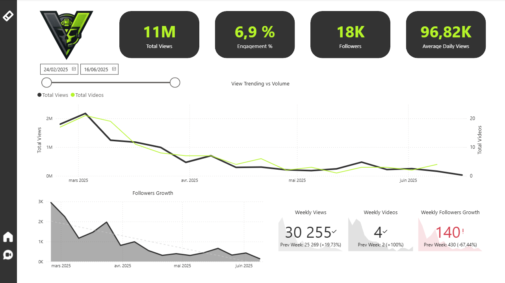
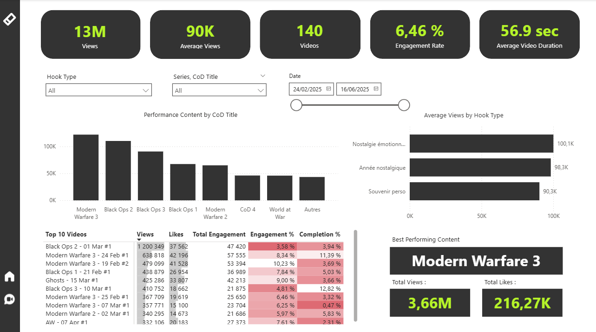
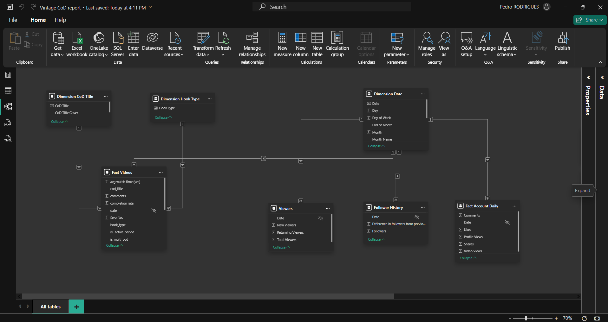

## 1. Présentation du projet

Ce projet de Data Analytics vise à analyser la performance du compte TikTok `@VintageCoDHQ` (`https://www.tiktok.com/@vintagecodhq`) à l’aide d’un dashboard construit sous Power BI.  
Il est conçu comme un projet de portfolio pour démontrer une **maîtrise complète du cycle d’analyse de données** orienté business, depuis la préparation des données jusqu’à la restitution finale des insights.

Le périmètre du projet couvre :

- **Collecte et préparation des données** issues des statistiques TikTok (vidéos, vues, likes, commentaires, partages, followers, etc.)
- **Nettoyage et transformation** des données pour les rendre exploitables (types, valeurs manquantes, granularité, cohérence des dates)
- **Modélisation en Star Schema** avec tables de faits et de dimensions
- **Création d’un dashboard Power BI interactif** pour suivre la performance du compte
- **Analyse des performances de contenu** (hook, titre, vues moyennes, différents types d’engagement...) et de la croissance de l’audience

Les dossiers `assets/` contiennent les **captures d’écran du data model** et des **visuels principaux** du rapport Power BI.  
Le fichier [`pbix/tiktok_analytics_dashboard.pbix`](pbix/tiktok_analytics_dashboard.pbix) contient le rapport Power BI complet, prêt à être ouvert et exploré dans Power BI Desktop.

---

## 2. Problématique / Questions business

L’objectif principal est de comprendre **comment les choix de contenu et le rythme de publication influencent la performance du compte TikTok**.

Les principales questions business traitées sont :

- **Impact du volume de publication**
  - Quel est l’impact du **nombre de vidéos publiées** sur le **nombre de vues totales** ?
  - Existe-t-il un **seuil de volume de publication** à partir duquel les performances se stabilisent ou décroissent ?

- **Croissance des followers**
  - Les vues totales et le volume de vidéos **contribuent-elles réellement** à la **croissance des followers** ?
  - Comment évolue la **courbe des abonnés** en fonction de la fréquence de publication et du nombre de vues ?

- **Performance des contenus (hook & titre)**
  - Quels types de **hooks** (accroches en début de vidéo) performent le mieux en termes de **vues** et d’**engagement** ?
  - Quels **titres** sont associés aux meilleures vidéos à fort potentiel de performance ?

- **Stratégies de contenu et engagement**
  - Quelles **combinaisons de caractéristiques de contenu** (hook, licence de Call of Duty, thématique) maximisent :
    - les **vues**
    - le **taux d’engagement** des vidéos
    - la probabilité de **générer de nouveaux followers** ?

---

## 3. Modélisation des données

La modélisation repose sur un **Star Schema** (schéma en étoile) afin de faciliter :

- la **lisibilité du modèle**
- la **performance des mesures DAX**
- la **flexibilité d’analyse** (filtres croisés par date, vidéo, type de contenu, croissance des followers...)

**Principales tables de faits** (exemples) :

- **`Fact Video`**  
  - Grain : une ligne par **vidéo**  
  - Mesures : vues, likes, commentaires, partages, taux d’engagement, taux de complétion, etc.

- **`Fact Account Daily`**  
  - Grain : une ligne par **date** (ou par période)  
  - Mesures : vues de vidéos, vues de profil, likes, commentaires, partages enregistrés chaque jour.

**Principales tables de dimensions** (exemples) :

- **`Dimension Date`** : calendrier (jour, semaine, mois, trimestre, année, indicateurs calendrier/marketing)
- **`Dimension CoD Title`** : informations liées au jeu Call of Duty mentionné dans la vidéo (nom du jeu, série)
- **`Dimension Hook`** : catégorisation du type d’accroche utilisée dans l’introduction de la vidéo (ex : nostalgie émotionnelle, souvenir personnel, année nostalgique, information historique).

Une **capture d’écran** est disponible dans le dossier `assets/` pour un aperçu de la liste exhaustive des tables de dimensions et de faits sans ouvrir Power BI (`assets/table_view.png`).

**Gestion des relations** :

- Schéma en étoile avec :
  - **Cardinalité** en **1:* (une dimension vers plusieurs faits)**
  - **Direction des filtres** en **single** (de la dimension vers la table de faits) pour éviter les ambiguïtés
- Certaines relations spécifiques ou calculs complexes (ex. analyse de la croissance de followers) sont gérées via :
  - **tables calculées**
  - **mesures DAX** plutôt que des relations bidirectionnelles

Le **screenshot du modèle de données** est disponible dans `assets/data_model.png` pour visualiser la structure complète.

Un **dictionnaire de données** détaillé (colonnes, types, descriptions, exemples) est disponible dans [`docs/DATA_DICTIONNARY.md`](docs/DATA_DICTIONNARY.md).

---

## 4. Dashboard et visualisations

Le dashboard Power BI est organisé pour répondre aux questions business de manière claire et actionnable.

**Principales pages / sections du rapport** :

- **Account Performance**  
  - KPI principaux : vues totales, taux d’engagement, followers, vidéos publiées  
  - Évolution temporelle : vues et followers par semaine / mois  
  - Cartes et indicateurs de croissance avec comme cible la performance de la semaine précédente.

- **Analyse du volume de publication**  
  - Vues totales vs nombre de vidéos publiées par période sur l’axe Y principal et l’axe Y secondaire.
  - Graphiques en courbes (line chart) et en aires (area chart) comparant le **volume de publication** et la **croissance des vues / followers**

- **Content Strategy Insights**  
  - Tableau détaillé par vidéo (titre, hook, vues, likes, commentaires, partages, taux d’engagement)  
  - Bar charts / boxplots pour identifier les **top vidéos** et les **contenus sous-performants**

- **Hooks, titres et engagement**  
  - Répartition des performances par **type de hook**  
  - Comparaison des **taux d’engagement moyens** par catégorie de hook / type de titre / thématique  
  - Visualisations permettant d’identifier les **patterns de contenu gagnants**

Les **captures d’écran des pages du dashboard** sont disponibles dans le dossier `assets/` pour un aperçu rapide sans ouvrir Power BI (`assets/dashboard_overview.png` et `assets/content_analysis.png`).

---

## 4.1 Aperçu du tableau de bord (Dashboard Preview)

Voici un aperçu visuel des principaux éléments du rapport Power BI et du modèle de données.

### Page de rapport 1 — Performance du compte

*Cette capture présente la première page du dashboard : les KPI du compte (vues totales, taux d’engagement, followers, nombre de vidéos), l’évolution des vues et des followers dans le temps, et les cartes de comparaison avec la période précédente. Elle permet de juger en un coup d’œil la santé du compte et l’impact des publications.*

### Page de rapport 2 — Stratégie de contenu et engagement

*Cette page met en avant l’analyse par type de contenu, hook et titre : tableaux détaillés par vidéo, graphiques en barres ou en boîtes pour les top vidéos et les contenus sous-performants, et la répartition des performances par type d’accroche. Elle sert à identifier les formats et combinaisons (hook, titre, thématique) qui performent le mieux.*

### Modèle de données Power BI (Star Schema)

*Cette vue montre la structure du modèle Power BI en schéma en étoile : tables de faits (performance vidéo, compte quotidien) au centre et dimensions (Date, Type de contenu, Hook, Titre CoD, Titre) reliées par des relations 1:*. Elle est utile pour comprendre comment les filtres et les mesures s’appliquent entre les tables et pour valider la cohérence du modèle.*

---

## 5. Insights principaux

Cette section synthétise des **exemples de types d’insights** que le dashboard permet de mettre en évidence (les chiffres exacts dépendent des données réelles du compte) :

- **Volume de publication**
  - On observe en général qu’une **augmentation modérée** du volume de publication est **corrélée à une hausse des vues**, jusqu’à un certain point où l’effet marginal diminue.
  - Un rythme de publication **régulier** semble plus impactant qu’un volume irrégulier concentré sur quelques jours.

- **Croissance des followers**
  - Les pics de croissance des followers coïncident souvent avec :
    - la **publication de vidéos performantes** (fort engagement)
    - des périodes de **plus forte fréquence de publication**
  - Le dashboard permet de **quantifier** cette relation (par ex. corrélation entre nombre de vidéos / période et variation de followers).

- **Hooks et titres performants**
  - Certains types de hooks (catégories d’accroche utilisées dans les vidéos, telles que nostalgie émotionnelle ou souvenir personnel) sont associés à :
    - davantage de **vues**
    - de meilleurs **taux de complétion**
  - Les titres qui **clarifient le bénéfice pour l’audience** tendent à générer un **engagement supérieur**.

- **Stratégies de contenu**
  - En croisant les dimensions (hook, titre, thématique, durée), le dashboard aide à :
    - identifier les **formats à prioriser**
    - repérer les **combinaisons à fort ROI**  
  - Ces insights permettent de **recommander une stratégie éditoriale** basée sur la donnée, et non uniquement sur l’intuition.

---

## 6. Stack technique

**Outils et technologies utilisés :**

- **Power BI**
  - Connexion aux fichiers de données exportés depuis TikTok
  - Power Query pour le **nettoyage**, la **transformation** et le **chargement** des données
  - Modélisation et création du **Star Schema**
  - Conception des **pages de rapport** et des visualisations

- **DAX (Data Analysis Expressions)**
  - Création de **mesures métier** : vues totales, taux d’engagement, croissance des followers, KPIs dérivés
  - Calculs temporels (variations, cumuls, comparaisons période à période)
  - Logique d’agrégation adaptée aux tables de faits et de dimensions

- **Git**
  - Gestion de versions des fichiers du projet (README, ressources, scripts éventuels)
  - Organisation du projet comme **portfolio GitHub** pour présenter :
    - la démarche analytique
    - la structure du modèle de données
    - des captures du dashboard Power BI

---

## 7. Limites des données et du périmètre de l’étude

L’analyse repose sur un **volume limité de vidéos**, ce qui peut restreindre la représentativité statistique des résultats et limiter la généralisation des conclusions à d’autres comptes ou périodes.  
Par ailleurs, **les données issues des lives TikTok ne sont pas incluses** dans le périmètre de ce projet, car elles ne sont pas accessibles via les sources ou outils utilisés ; cela constitue une limite importante puisque ces formats représentent une part significative de l’activité sur la plateforme.  
De plus, le **volume de vidéos collectées diminue à partir du mois de mars**, ce qui peut introduire un biais temporel dans l’analyse et affecter la comparabilité entre les différentes périodes étudiées.  
Ces limitations n’invalident pas l’étude, mais doivent être **explicitement prises en compte lors de l’interprétation des résultats** et de leur transposition à d’autres contextes.

---

Ce projet illustre une **démarche complète de Data Analytics appliquée à un cas réel de marketing digital (TikTok)**, avec un focus sur la **qualité de la modélisation**, la **rigueur des mesures DAX** et la **capacité à transformer des données brutes en recommandations actionnables** pour un créateur de contenu ou une équipe marketing.

